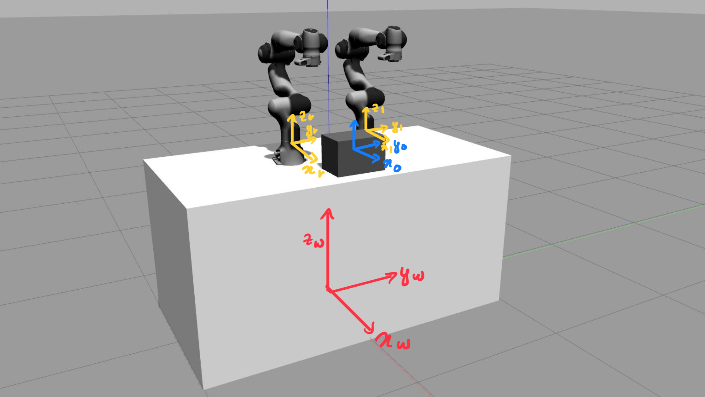

# Bi-Manual Redundancy Optimization

## Description
This repository is under development and includes the work currently being carried out in Bi-Manual Redundancy Optimization.

## Features
- Bi-Manual Redundancy Optimization
- Integration with Franka Emika Panda robots
- MoveIt! configuration for multiple arms

## Installation
1. Create a workspace:
    ```bash
    mkdir -p ~/franka_ros1_ws/src
    cd ~/franka_ros1_ws/src
    ```

2. Clone the `franka_ros` repository from the Franka Emika website:
    ```bash
    git clone https://github.com/frankaemika/franka_ros.git
    ```

3. Clone the following packages and folders:
    ```bash
    git clone https://github.com/Debojit-D/without_gripper_panda_multiple_arms.git
    git clone https://github.com/Debojit-D/without_gripper_panda_multiple_arms_moveit_config.git
    ```

4. Navigate back to the workspace root and build the workspace:
    ```bash
    cd ~/franka_ros1_ws
    catkin_make
    ```

Given below is the image of how the differet reference frames have been considered.




## Usage
```bash
# Source the workspace
source devel/setup.bash

# Launch the project
roslaunch without_gripper_panda_multiple_arms bringup_moveit.launch.
```

### Custom ROS Topics

This project includes several custom ROS topics that provide essential information for bi-manual manipulation and redundancy optimization in the simulation environment with two Franka robots.

#### `/compliant_box_pose`
Publishes the pose information of the box being grasped by the two Franka robots in the simulation. The data is provided as:
- **Position:** (x, y, z)
- **Orientation (Quaternion):** (x, y, z, w)

#### `/left_contact_frame_basis`
Provides the basis information of the left contact point in the simulation. The basis is represented as:
- **Rotation Matrix:** [si, ti, ni] relative to the world frame.

#### `/right_contact_frame_basis`
Provides the basis information of the right contact point in the simulation. Similar to the left contact frame, it is represented as:
- **Rotation Matrix:** [si, ti, ni] relative to the world frame.

#### `/left_manipulator_jacobian`
Publishes the Jacobian matrix for the left manipulator. This includes information necessary for understanding the relationship between joint velocities and the end-effector velocities for the left arm.

#### `/right_manipulator_jacobian`
Publishes the Jacobian matrix for the right manipulator, providing similar information as the left, crucial for controlling the end-effector's movements based on joint velocities.

#### `/left_end_effector_pose`
Provides the pose of the left end effector, including:
- **Position:** (x, y, z)
- **Orientation (Quaternion):** (x, y, z, w)

#### `/right_end_effector_pose`
Provides the pose of the right end effector, including:
- **Position:** (x, y, z)
- **Orientation (Quaternion):** (x, y, z, w)

#### `/hand_jacobian`
Publishes the Jacobian matrix for the hand. This matrix is essential for understanding the relationship between the joint velocities of the hand and the velocities of the hand's end-effector.

#### `/grasp_matrix`
Publishes the grasp matrix, which is crucial for understanding the grasp quality and the relationship between the forces applied by the fingers and the resultant forces and torques on the object being grasped.

rosservice call /link_attacher_node/attach "model_name_1: 'panda_multiple_arms'
link_name_1: 'right_arm_link7'
model_name_2: 'compliant_box'
link_name_2: 'box_link'"

rosservice call /link_attacher_node/attach "model_name_1: 'panda_multiple_arms'
link_name_1: 'left_arm_link7'
model_name_2: 'compliant_box'
link_name_2: 'box_link'"

For detach use dettach instead of attach 